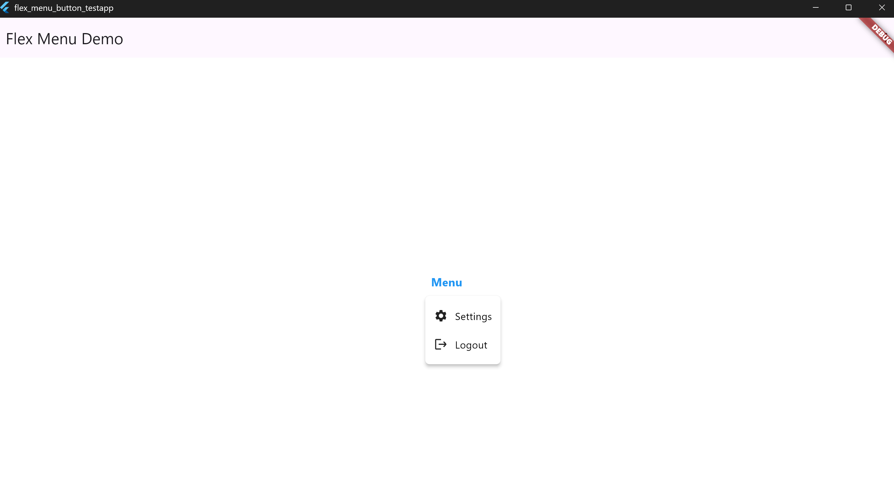

# 🔽 flex_menu_button

A customizable and lightweight Flutter dropdown menu button designed to be used in `AppBar`s, `Toolbars`, or anywhere you want quick access to menu actions. It supports icons, text, headers, footers, dividers, custom widgets, flexible alignment, and full style control.

---

## Features

🔘 Works out of the box — no dependencies  
🔘Custom icon, label, text styles  
🔘Optional header and footer widgets  
🔘Dropdown alignment and screen-side flipping  
🔘Custom width, max height, padding, and scrolling  
🔘Optional custom widgets, dividers, and trailing elements  
🔘Tooltip customization  
🔘Fully modular, easy to extend

---

## Installation

Add this to your `pubspec.yaml`:

```yaml
dependencies:
  flex_menu_button: ^<latest_version>
````

Then run:

```bash
flutter pub get
```

---

## 🔘 1. Basic Usage

```dart
MenuDropdownButton(
  tooltip: 'Options',
  icon: Icons.more_vert,
  items: [
    MenuItem(icon: Icons.edit, label: 'Edit', onTap: () {}),
    MenuItem(icon: Icons.delete, label: 'Delete', onTap: () {}),
  ],
)
````

📸 Screenshot:


---

## 🔘 2. Menu Alignment Options

```dart
MenuDropdownButton(
  tooltip: 'Align Center',
  icon: Icons.more_horiz,
  config: MenuDropdownConfig(
    alignment: MenuAlignment.center,
  ),
  items: [
    MenuItem(icon: Icons.share, label: 'Share', onTap: () {}),
    MenuItem(icon: Icons.link, label: 'Copy Link', onTap: () {}),
  ],
)
```

📸 Screenshot:


---

## 🔘 3. Header & Footer

```dart
MenuDropdownButton(
  tooltip: 'Menu with Header/Footer',
  icon: Icons.menu,
  header: Padding(
    padding: EdgeInsets.all(8),
    child: Text('Header: Account Actions', style: TextStyle(color: Colors.white)),
  ),
  footer: Padding(
    padding: EdgeInsets.all(8),
    child: Text('Footer: Version 1.0.0', style: TextStyle(color: Colors.grey)),
  ),
  items: [
    MenuItem(icon: Icons.account_circle, label: 'Profile'),
    MenuItem(icon: Icons.logout, label: 'Logout'),
  ],
)
```

📸 Screenshot:

)

---

## 🔘 4. Custom Colors and Text Styles

```dart
MenuDropdownButton(
  tooltip: 'Styled Menu',
  icon: Icons.palette,
  config: MenuDropdownConfig(
    backgroundColor: Colors.blue,
    labelTextStyle: TextStyle(color: Colors.yellowAccent),
    tooltipBackgroundColor: Colors.black87,
    tooltipTextColor: Colors.white,
  ),
  items: [
    MenuItem(icon: Icons.visibility, label: 'Preview'),
    MenuItem(icon: Icons.save, label: 'Save Draft'),
  ],
)
```

📸 Screenshot:

)

---

## 🔘 5. Fixed Width and Max Height

```dart
MenuDropdownButton(
  tooltip: 'Sized Menu',
  icon: Icons.aspect_ratio,
  config: MenuDropdownConfig(
    width: 200,
    maxHeight: 150,
  ),
  items: List.generate(
    10,
    (i) => MenuItem(icon: Icons.star, label: 'Item ${i + 1}'),
  ),
)
```

📸 Screenshot:


---

## 🔘 6. Divider and Custom Widgets

```dart
MenuDropdownButton(
  tooltip: 'Custom Items',
  icon: Icons.widgets,
  items: [
    MenuItem(icon: Icons.settings, label: 'Settings'),
    MenuItem(isDivider: true),
    MenuItem(
      customWidget: Padding(
        padding: EdgeInsets.all(12),
        child: Row(
          children: [
            CircleAvatar(radius: 12, backgroundColor: Colors.orange),
            SizedBox(width: 10),
            Text('Custom User Widget', style: TextStyle(color: Colors.white)),
          ],
        ),
      ),
    ),
  ],
)
```

📸 Screenshot:


---

## 🔘 7. Custom Icon Color & Size for the Root Button

```dart
MenuDropdownButton(
  icon: Icons.more_vert,
  tooltip: "Menu",
  iconColor: Colors.red,
  iconSize: 30,
  items: [
    MenuItem(icon: Icons.settings, label: 'Settings'),
    MenuItem(icon: Icons.logout, label: 'Logout'),
  ],
)
```

📸 Screenshot:


---

## 🔘 8. Custom Header & Footer Styles

```dart
MenuDropdownButton(
  icon: Icons.menu,
  tooltip: "Menu",
  header: Text('Menu Header'),
  footer: Text('Footer Note'),
  config: MenuDropdownConfig(
    headerTextStyle: TextStyle(
      color: Colors.blue,
      fontSize: 16,
      fontWeight: FontWeight.bold,
    ),
    footerTextStyle: TextStyle(
      color: Colors.green,
      fontSize: 12,
      fontStyle: FontStyle.italic,
    ),
  ),
  items: [
    MenuItem(icon: Icons.home, label: 'Home'),
    MenuItem(icon: Icons.person, label: 'Profile'),
  ],
)
```

📸 Screenshot:


---

## 🔘 9. Custom Tooltip Colors

```dart
MenuDropdownButton(
  icon: Icons.info,
  tooltip: "Info Tooltip",
  tooltipTextColor: Colors.black,
  tooltipBackgroundColor: Colors.yellow,
  items: [
    MenuItem(icon: Icons.help, label: 'Help'),
  ],
)
```

📸 Screenshot:


---

## 🔘 10. Label and Icon Colors for Items

```dart
MenuDropdownButton(
  icon: Icons.more_horiz,
  tooltip: "Options",
  items: [
    MenuItem(icon: Icons.edit, label: 'Edit'),
    MenuItem(icon: Icons.delete, label: 'Delete'),
  ],
  config: MenuDropdownConfig(
    backgroundColor: Colors.grey[850]!,
    itemIconColor: Colors.amber, // icon color
    labelTextStyle: TextStyle(color: Colors.cyan, fontSize: 16), // text style
    iconSize: 22,
  ),
)
```

📸 Screenshot:


---

## 🔘 11. Root Text Instead of Icon

```dart
MenuDropdownButton(
  tooltip: 'Open Menu',
  label: 'Menu',
  labelTextStyle: TextStyle(
    fontSize: 16,
    fontWeight: FontWeight.bold,
    color: Colors.blue,
  ),
  items: [
    MenuItem(icon: Icons.settings, label: 'Settings'),
    MenuItem(icon: Icons.logout, label: 'Logout'),
  ],
)
```

📸 Screenshot:



---

## 🔘 12. Root Icon + Text Combination

```dart
MenuDropdownButton(
  tooltip: 'Open Panel',
  icon: Icons.menu,
  rootText: 'Dashboard',
  rootTextStyle: TextStyle(
    fontSize: 15,
    color: Colors.deepPurple,
  ),
  items: [
    MenuItem(icon: Icons.dashboard, label: 'Overview'),
    MenuItem(icon: Icons.analytics, label: 'Reports'),
  ],
)
```

📸 Screenshot:


---

## 🔘 13. Invisible Trigger (Secret Function Example)

```dart
MenuDropdownButton(
  tooltip: 'Hidden Dev Options',
  items: [
    MenuItem(icon: Icons.bug_report, label: 'Debug Mode'),
    MenuItem(icon: Icons.lock, label: 'Security Console'),
  ],
)
```

📸 Screenshots:


---

## 🔘 14. Dropdown Size Customization & Auto-Resizing

The `flex_menu_button` widget supports both **automatic content-based sizing** and **manual width control**.

---

### 🔍 Visual Comparison

|               Icon Only (Auto)                |            Icon Only (Fixed Width)             |                 Icon + Text (Auto)                 |
| :-------------------------------------------: | :--------------------------------------------: | :------------------------------------------------: |
|  |  |  |

---

### ✅ Example 1 – Icons Only (Auto-Sized)

```dart
MenuDropdownButton(
  icon: Icons.more_vert,
  tooltip: 'Options',
  config: MenuDropdownConfig(),
  items: [
    MenuItem(icon: Icons.copy, label: ''),
    MenuItem(icon: Icons.share, label: ''),
    MenuItem(icon: Icons.delete, label: ''),
  ],
)
```

📸 Screenshot:

---

### ✅ Example 2 – Icons Only (Fixed Width)

```dart
MenuDropdownButton(
  icon: Icons.more_vert,
  tooltip: 'Options',
  config: MenuDropdownConfig(
    width: 180,
  ),
  items: [
    MenuItem(icon: Icons.copy, label: ''),
    MenuItem(icon: Icons.share, label: ''),
    MenuItem(icon: Icons.delete, label: ''),
  ],
)
```

📸 Screenshot:

---

### ✅ Example 3 – Icons + Text (Auto-Sized)

```dart
MenuDropdownButton(
  icon: Icons.more_vert,
  tooltip: 'Options',
  config: MenuDropdownConfig(),
  items: [
    MenuItem(icon: Icons.copy, label: 'Copy'),
    MenuItem(icon: Icons.share, label: 'Share'),
    MenuItem(icon: Icons.delete, label: 'Delete'),
  ],
)
```

📸 Screenshot:

---

📝 **Note:**  
If you don't specify a width in `MenuDropdownConfig`, the dropdown will scale based on the **largest element** (icon, label, or trailing widget). You can override this with a fixed `width` value if layout consistency is preferred.

---

## 👨‍💻 Developer

### 🔗 Connect with Me

- 🐦 [X/Twitter](https://x.com/kutlwano_drew)

- 💻 [GitHub](https://github.com/kutlwano-drew)

---

### ☕ Buy Me a Coffee

- [☕ Support Here](https://buymeacoffee.com/kutlwano_drew)
  
---
